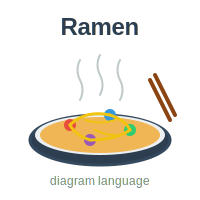

# The Ramen Language Specification

> NB: Ramen is under development and breaking changes will happen.

## Overview

Ramen is a declarative domain-specific language (DSL) for creating diagrams. It emphasizes clear hierarchical structure, flexible metadata, and visual portability across different rendering tools.

## Design Principles

- **Text as source of truth**: Diagrams are defined in plain text for maximum portability
- **Hierarchical scoping**: Containers provide visual and logical grouping
- **Metadata separation**: Visual properties are separated from structural definitions
- **Forward references**: Elements can reference other elements before they are defined

## Lexical Elements

### Identifiers
- Must follow CamelCase convention: `myNode`, `UserInterface`, `apiGateway`
- May contain letters and numbers, must start with a letter
- Case-sensitive

### String Literals

**Single-line strings**:
```ramen
"Hello World"
"API endpoint"
```

**Multi-line strings**:
```ramen
\"
This is a multi-line string
that can span several lines
"\
```

### Comments
Not supported in MVP.

## Core Constructs

### Containers
Containers define scopes that group related elements and provide visual boundaries.

**Syntax**: `ContainerName { ... }`

**Rules**:
- Must contain at least one element (node, edge, or sub-container)
- Empty containers `{}` are invalid syntax
- Containers can be nested to arbitrary depth

**Example**:
```ramen
Frontend {
  userInterface
  router
  stateManager
}
```

### Nodes
Nodes are the basic elements within containers.

**Syntax**: `nodeName`

**Rules**:
- Defined by simple identifier within a container scope
- Multiple nodes with the same name are allowed if disambiguated with unique references

**Example**:
```ramen
Backend {
  database
  apiServer
  cache
}
```

### Edges
Edges define connections between nodes and containers.

**Types**:
- `A -> B` - Unidirectional (A to B)
- `A <- B` - Unidirectional (B to A)  
- `A - B` - Undirected
- `A <-> B` - Bidirectional

**Labels**:
```ramen
frontend -> backend | "HTTP requests"
cache <- database | "data sync"
```

**Example**:
```ramen
System {
  frontend
  backend
  database
  
  frontend -> backend | "API calls"
  backend <-> database | "data persistence"
}
```

## Reference System

### Dot Notation
Reference elements in other containers using dot notation.

**Syntax**: `Container.node` or `Container.SubContainer.node`

**Examples**:
```ramen
Frontend {
  app
}

Backend {
  api
}

Frontend.app -> Backend.api
```

**Nested references**:
```ramen
Cloud {
  AWS {
    lambda
    s3
  }
}

OnPremise {
  server
}

OnPremise.server -> Cloud.AWS.lambda
```

### Unique References
When multiple nodes share the same name, assign unique references using the :refId syntax.

**Syntax:**

- Declaration: `nodeName :refId`
- Reference: `Container.ref(refId)`
- Metadata: `ref(refId): { properties }`


Example:

```
ramenNetwork {
  router :mainRouter
  router :backupRouter
  switch
}

Network.ref(mainRouter) -> Network.switch
Network.ref(backupRouter) -> Network.switch

Network.ref(mainRouter): {
  color: "green"
  position: "primary"
}

Network.ref(backupRouter): {
  color: "orange"
  position: "backup"
}
```

### Forward References
Elements can reference other elements before they are defined in the text.

**Example**:
```ramen
Car {
  engine -> AWS.database
}

AWS {
  database
}
```

## Metadata System

Metadata defines visual and behavioral properties separate from structural definitions.

### Scoping Rules
Metadata is always defined at the same hierarchical level as the target element's definition.

**Node metadata** (defined within the container that contains the node):
```ramen
System {
  frontend
  backend
  
  frontend: {
    color: "blue"
    x: 100
    y: 50
  }
}
```

**Container metadata** (defined at the same level as the container):
```ramen
System {
  frontend
  backend
}

System: {
  layout: "horizontal"
  background: "#f0f0f0"
}
```

### Property Types

**Layout Properties** (containers):
- `layout: "manual" | "horizontal" | "vertical" | "grid" | "auto"`
- `background: "color"`
- `padding: number`

**Position Properties** (nodes):
- `x: number`
- `y: number`

**Visual Properties** (nodes and containers):
- `color: "colorValue"`
- `shape: "rectangle" | "circle" | "diamond" | "cylinder"`
- `size: "small" | "medium" | "large"`

**Content Properties**:
- `content: "string"` (supports multi-line strings)
- `font: "fontName"`

### Reference Metadata
Metadata for elements referenced by unique ID.

**Syntax**: `ref(uniqueId): { properties }`

**Example**:
```ramen
Network {
  router :mainRouter
  
  ref(mainRouter): {
    color: "green"
    size: "large"
  }
}
```

## Implicit Root Container

Elements defined at the top level exist within an implicit root container that has no syntax representation.

**Example**:
```ramen
database
webServer
loadBalancer

database -> webServer
loadBalancer -> webServer

database: {
  color: "blue"
}
```

Here, `database`, `webServer`, and `loadBalancer` are nodes in the implicit root container.

## Grammar Rules

### Precedence
1. Container definitions and metadata blocks
2. Node definitions  
3. Edge definitions with labels
4. Metadata property assignments

### Constraints
- Container names must be unique within their scope
- Node names must be unique within their container (unless using unique references)
- Edges can only connect valid node or container references
- Metadata can only reference existing elements

### Error Conditions
- Empty containers: `Container {}`
- Invalid references: `unknownContainer.unknownNode`
- Duplicate names without unique references in the same scope
- Metadata for non-existent elements

### Reference assignment:

- Optional for nodes with unique names in their scope
- Required when multiple nodes share the same name
- Uses colon syntax consistent with edge labels: :refId

### Reference resolution:

- Container.nodeName - references node by name (must be unique)
- Container.ref(refId) - references node by assigned reference ID

## Complete Example

```ramen
Frontend {
  userInterface
  router
  stateManager
  
  userInterface -> router | "navigation"
  router -> stateManager | "state updates"
}

Backend {
  apiGateway
  authService
  database
  
  apiGateway -> authService | "authentication"
  authService -> database | "user data"
}

Frontend.router -> Backend.apiGateway | "API requests"

Frontend: {
  layout: "horizontal"
  background: "#e3f2fd"
}

Backend: {
  layout: "vertical"
  background: "#f3e5f5"
}

Frontend.userInterface: {
  color: "blue"
  shape: "rectangle"
  x: 50
  y: 100
}

Backend.database: {
  color: "green"
  shape: "cylinder"
  x: 200
  y: 300
}
```
